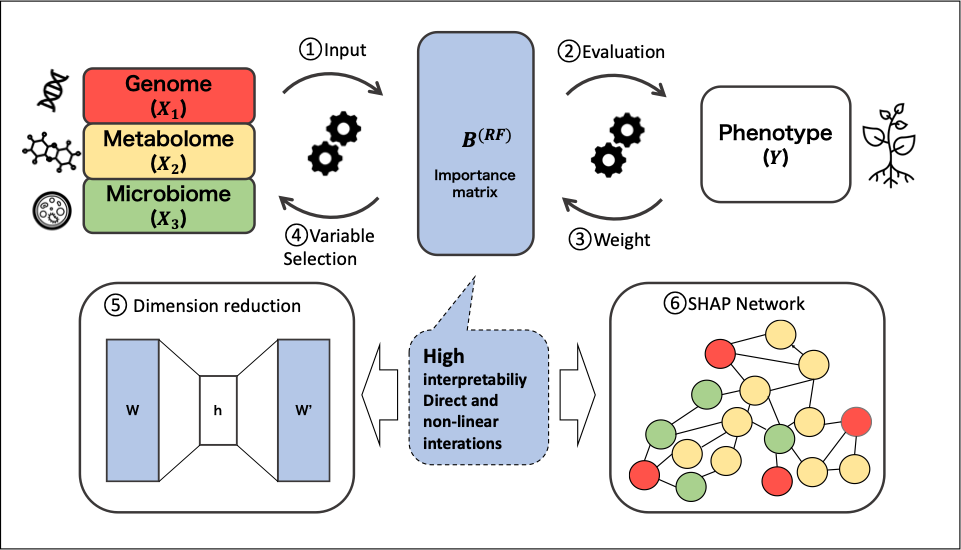

# Interpretable multi-omics machine learning reveals drought-driven shifts in plant-microbe interactions

This repository contains all scripts and data used for the analysis in **“Interpretable Machine Learning on Soybean Multi-Omics Data Reveals Drought-Driven Shifts of Plant–Microbe Interactions.”**

📄 Article available at: [https://doi.org/10.1186/s40793-026-00883-x](https://doi.org/10.1186/s40793-026-00883-x)

---

---

## 📂 script_ShapPlantMicro
All scripts 

| File | Description |
|------|--------------|
| `c0_RF-markers.Rmd` | Random Forest marker evaluation |
| `c1_RF_prediction.Rmd` | Random Forest prediction |
| `c2_BLUP_prediction.Rmd` | BLUP (Best Linear Unbiased Prediction) |
| `c3_GWAS.Rmd` | GWAS (Genome-Wide Association Study) analysis |
| `c4_SNP_Mapping.Rmd` | SNP selection by RF and GWAS |
| `c5_SHAP_single.Rmd` | SHAP analysis for single feature selection |
| `c6_SHAP_interaction.Rmd` | SHAP for interaction feature selection |
| `c7_SHAP_difference.Rmd` | SHAP difference matrix visualization |
| `c8_hyperparameter_xgboost.Rmd` | Hyperparameter Tuning for XGBoost |
| `c9_hyperparameter_ranger.Rmd` | Hyperparameter Tuning for ranger |
| `c10_rf_null.Rmd` | Null distribution of RF prediction accuracy |

---

## 📂 data 
Multi-omics data (Genome, Microbiome, Metabolome, Phenotype) ready for analysis.

| File | Description |
|------|--------------|
| `SoyData_Drought2.RDS` | Multi omics data - Drought |
| `SoyData_Control2.RDS` | Multi omics data - Control |

---

## 📂 data/genome
Genome marker data (with different LD thresholds)

| File | Description |
|------|--------------|
| `genoMarker_LD0.001_SNP3078.RDS`  | SNP markers filtered at LD = 0.001 |
| `genoMarker_LD0.01_SNP10143.RDS`  | SNP markers filtered at LD = 0.01  |
| `genoMarker_LD0.1_SNP16419.RDS`   | SNP markers filtered at LD = 0.1   |
| `genoMarker_LD0.3_SNP34632.RDS`   | SNP markers filtered at LD = 0.3   |
| `genoMarker_LD0.001_SNP3078.csv`  | SNP markers filtered at LD = 0.001 |
| `genoMarker_LD0.01_SNP10143.csv`  | SNP markers filtered at LD = 0.01  |
| `genoMarker_LD0.1_SNP16419.csv`   | SNP markers filtered at LD = 0.1   |
| `genoMarker_LD0.3_SNP34632.csv`   | SNP markers filtered at LD = 0.3   |
---

## 📂 data/raw
Multi-Omics data raw files. Data include both control and drought conditions.

| File | Description |
|------|--------------|
| `metabolome.csv`   | Metabolome (265 features)|
| `microbiome.csv` | Microbiome (16457 features)|
| `phenotype.csv` | Phenotype (9 features)|
---

